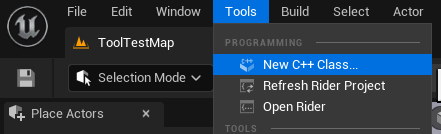
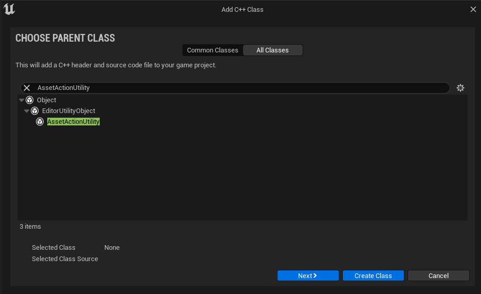
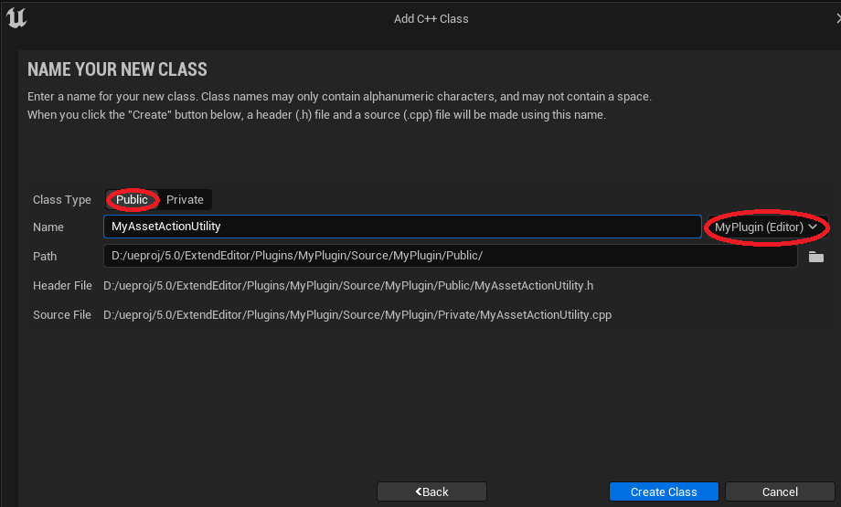
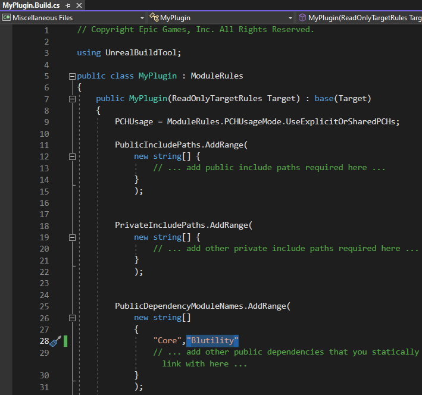
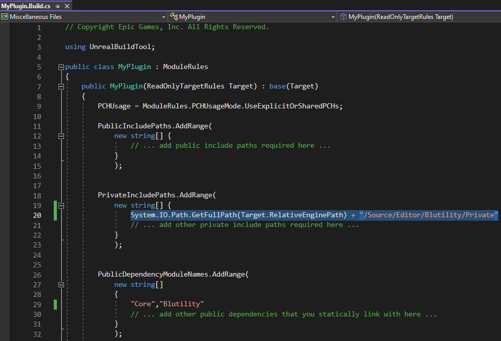

# ue5-plugins-tools-cheatsheet
Simple notes on how to create plugins for Unreal Engine 5.

## Environment:
- Windows 11/10
- Engine version: 5.x.x
- Project Codebase: C++ (Noted if anything else like Blueprints, Python, etc.)
- IDE: Visual Studio 2022

## Useful Classes/Libraries for UE5 Tools
- [UEditorUtilityLibrary](https://docs.unrealengine.com/5.2/en-US/API/Editor/Blutility/UEditorUtilityLibrary/) (part of the ```Blutility``` module)

    ```c++
    // Gets the set of currently selected assets (in the Content Browser)
    static TArray<UObject*> GetSelectedAssets()
    // Get the set of asset data from currently selected assets (in the Content Browser)
    static TArray<FassetData&> GetSelectedAssetData()
    ```
- [UEditorAssetLibrary](https://docs.unrealengine.com/4.26/en-US/API/Plugins/EditorScriptingUtilities/UEditorAssetLibrary/) (part of the ```EditorScriptingUtilities``` module)

    ```c++
    // Duplicates an asset (from source path to destination path)
    static UObject * DuplicateAsset(const FString& SourceAssetPath, const FString& DestinationPath)
    ```

# Creating Plugin Module
1. In the UE Editor, go to top menu->Edit->Plugins:


2. In the Plugins Window, click +Add:


3. In the New Plugin Window, select your template type, enter the folder path for your new plugin, and enter you new plugin's name.


    - Try to get your Plugin Name correct here, as renaming a plugin later on can be tedious.
    - Entries for Descriptor Data and Advanced items are optional.
    - Show Content Directory should remain checked.

4. Go to Visual Studio for the project (if not already open, go to Tools->Open Visual Studio).

5. In VS, open your .uplugin file (usually under Games/ProjectName/Plugins/PluginName/ in the Solution Explorer).

6. In the .uplugin file, change Modules.{firstObject}.Type to "Editor" and Modules.{firstObject}.LoadingPhase to "PreDefault".


7. Close your Editor project, and then re-build the C++ project in VS (can use the shortcut Ctrl+F5), which will also re-open the Editor.

# Asset Action Utility ([UAssetActionUtility](https://docs.unrealengine.com/5.2/en-US/API/Editor/Blutility/UAssetActionUtility/))
- A right-click menu item function (under "Scripted Asset Actions") on an asset in the Content Browser.
1. In the Editor, select top menu->Tools->New C++ Class...



2. In the Add C++ Class window, select "All Classes", and type "AssetActionUtility" in the search bar.  Then, click Next>.



3. Give your new Class a name.  Make sure it is public and that it is part of your plugin project.



4. Add the Blutility module to PublicDependencyModuleNames in the Plugin's Build.cs file.  (The Blutility module is what contains the UAssetActionUtlity's header file.)



5. Since the Blutility module is private, we must also add the path of this module to the PrivateIncludePaths array:



6. In the IDE and in the header file for your new Asset Action Utility subclass, declare the function that will be the menu item.  Give it the ```UFUNCTION(CallInEditor)``` attribute.

    ```c++
    UCLASS()
    class MYPLUGIN_API UMyAssetAction : public UAssetActionUtility
    {
        GENERATED_BODY()

    public:
        UFUNCTION(CallInEditor)
        void MyFunction();
    ...
    ```
