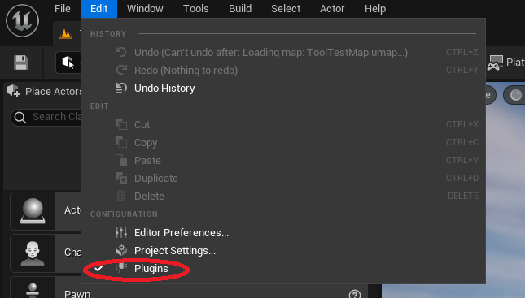
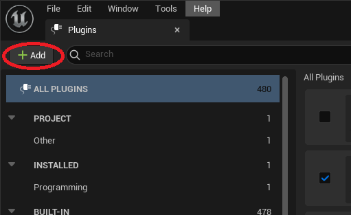
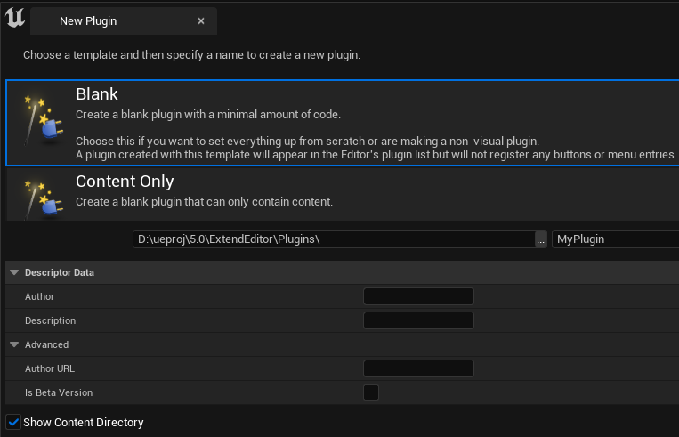
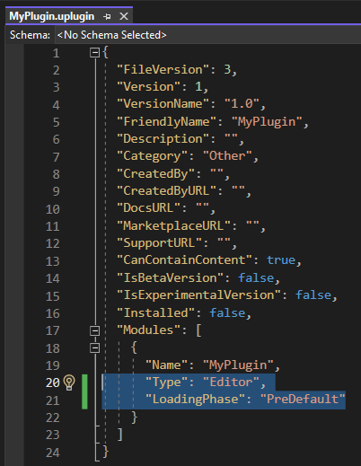

# ue5-plugins-tools-cheatsheet
Simple notes on how to create plugins for Unreal Engine 5.

## Environment:
- Windows 11/10
- Engine version: 5.x.x
- Project Codebase: C++ (Noted if anything else like Blueprints, Python, etc.)
- IDE: Visual Studio 2022

# Creating Plugin Module
1. In the UE Editor, go to top menu->Edit->Plugins:

2. In the Plugins Window, click +Add:

3. In the New Plugin Window, select your template type, enter the folder path for your new plugin, and enter you new plugin's name.

    - Try to get your Plugin Name correct here, as renaming a plugin later on can be tedious.
    - Entries for Descriptor Data and Advanced items are optional.
    - Show Content Directory should remain checked.

4. Go to Visual Studio for the project (if not already open, go to Tools->Open Visual Studio).

5. In VS, open your .uplugin file (usually under Games/ProjectName/Plugins/PluginName/ in the Solution Explorer).

6. In the .uplugin file, change Modules.{firstObject}.Type to "Editor" and Modules.{firstObject}.LoadingPhase to "PreDefault".

7. Close your Editor project, and then re-build the C++ project in VS (can use the shortcut Ctrl+F5), which will also re-open the Editor.

# Asset Action Utility (UAssetActionUtility class)
